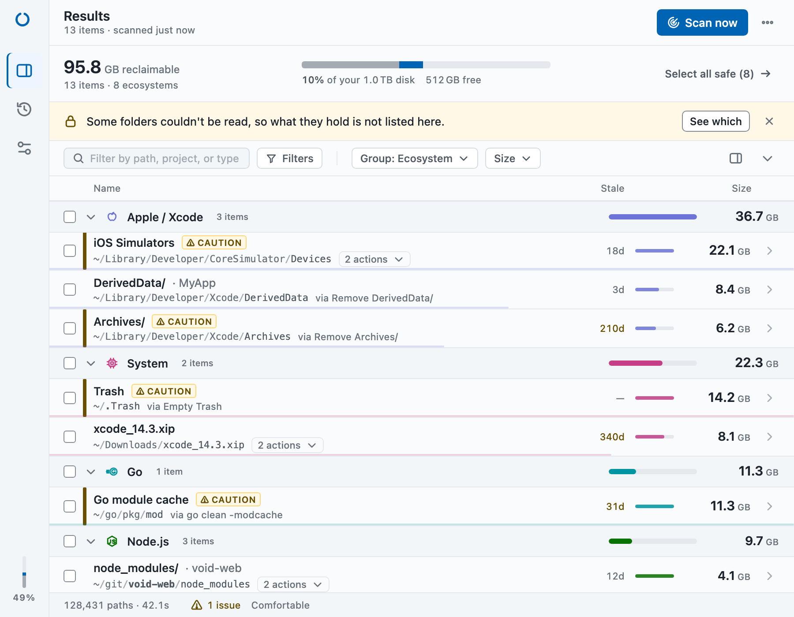

<div align="center">


# Void

**Void cleans up after your AI agents — and your agents can call Void themselves.**

Void finds and cleans developer disk bloat across 15 ecosystems: agent worktrees, agent
transcripts, local AI models and the build artifacts behind them. One scan, gigabytes back.
Everything runs locally.

[](https://github.com/eladbash/void/actions/workflows/ci.yml)
[](https://github.com/eladbash/void/releases)
[](LICENSE)
[](https://www.rust-lang.org/)

[Download](https://github.com/eladbash/void/releases) · [Website](https://eladbash.github.io/void/) · [Contributing](CONTRIBUTING.md) · [Changelog](CHANGELOG.md)

<picture>
  <source media="(prefers-color-scheme: dark)" srcset="docs/shot-dark.png">
  
</picture>

</div>

---

## Why Void?

Every project you touch leaves something behind: a `target/` here, a `node_modules/` there,
a Docker build cache quietly eating 20 GB. AI coding agents multiply that. Each parallel
session gets its own git worktree with its own dependencies and build output, every
conversation is saved as a transcript, and every model you tried is still sitting in
`~/.ollama` or the Hugging Face cache. You know it's there. You just don't know *where*,
or which parts are safe to remove.

Void answers both questions. It walks your home directory in parallel, groups what it
finds by ecosystem, tells you how stale each item is, and labels every cleanup action with
a risk level before you click it. Nothing is deleted without your say-so. And because your
agents are the ones filling the disk, they can ask Void for a plan themselves, from the
command line or over MCP.

## Highlights

- **15 ecosystem scanners**: agent worktrees, AI agent data, local AI models, stale projects,
  Rust, Node.js, Python, Go, Java, Docker, Apple/Xcode, Homebrew, JetBrains, .NET and system caches
- **Built for the AI era**: worktrees from Claude Code, Cursor, Codex and Conductor, agent
  transcripts and editor state, Ollama and Hugging Face models, duplicate model files
- **Agents can call Void**: a `void` CLI with JSON output and dry-run plans, an MCP server, and
  Claude Code hooks
- **Guard mode**: watches free space in the background and warns before the disk fills up;
  optional auto-clean policies that only ever run Safe actions
- **Safety first**: blocked-path lists, sentinel-file detection, Safe / Caution / Danger on every
  action, Move to Trash for anything worth recovering
- **Fast**: multi-threaded filesystem walker with concurrent analysis, built on Tokio and the
  `ignore` crate
- **Nothing runs unseen**: every item shows the exact command or deletion it will perform
- **Keeps a record**: each clean is stored locally with the paths, commands and bytes recovered
- **Local only**: no account, no telemetry. Void never uploads anything

## Install

### macOS

```bash
curl -fsSL https://raw.githubusercontent.com/eladbash/void/main/install.sh | sh
```

Downloads the latest `.dmg` for your architecture, installs to `/Applications`, and launches it.

### Linux & Windows

Grab the installer for your platform from the [Releases page](https://github.com/eladbash/void/releases).

### The `void` CLI

The CLI (and the MCP server inside it) is a separate binary. Release builds don't ship it yet,
so for now install it from source. You need [Rust](https://rustup.rs/) 1.95+; the CLI does not
need the Tauri toolchain or any system libraries.

```bash
git clone https://github.com/eladbash/void.git
cd void
cargo install --path crates/void-cli    # builds and installs `void` into ~/.cargo/bin
void --version
```

`~/.cargo/bin` must be on your `PATH` (rustup adds it; if `void` is not found, add
`export PATH="$HOME/.cargo/bin:$PATH"` to your shell profile). The desktop app looks for `void`
there too — its **Install hooks** and **MCP** buttons on the Agents screen need the CLI installed.

Then connect it to your agents:

```bash
void scan                           # see what's reclaimable (changes nothing)
claude mcp add void -- void mcp     # let Claude Code call Void as an MCP server
void mcp-config                     # JSON snippet for other MCP clients (Cursor, Codex…)
void hook install                   # optional: low-disk warning + worktree trim hooks
```

To update, pull and run the same `cargo install` command again (add `--force` if cargo says it is
already installed). To remove: `void hook uninstall` (if you installed hooks), then
`cargo uninstall void-cli`.

### Desktop app from source

Requires [Rust](https://rustup.rs/) 1.95+ and the [Tauri CLI](https://tauri.app/).

```bash
cargo tauri dev      # run in development
cargo tauri build    # produce a release bundle
```

## How it works

1. **Scan**: Void walks your configured roots (your home directory by default) with a parallel
   walker, using half your cores and up to 8 concurrent analyses, and checks the well-known
   global locations (caches, agent data, model stores) directly.
2. **Review**: results are grouped by ecosystem with size, last-modified date, a risk level and
   the facts you need to decide: a worktree's branch and unpushed commits, a model's tag, which
   agent produced it.
3. **Clean**: each item carries its own actions (`cargo clean`, `git worktree remove`,
   `docker builder prune`, Move to Trash, delete), lowest risk first. Void re-checks the safety
   gates, runs it, and reports what it freed.

## What Void finds

| Ecosystem | Artifacts |
|-----------|-----------|
| **Agent worktrees** | Git worktrees from Claude Code (`<repo>/.claude/worktrees`), Cursor (`~/.cursor/worktrees`), Codex (`~/.codex/worktrees`), Conductor (`~/conductor/workspaces`) and custom roots; orphaned worktrees; stale worktree records; merged agent branches |
| **AI agent data** | Claude Code transcripts, file history, debug logs and caches; Codex sessions; Cursor / VS Code / Windsurf state databases and orphaned workspace storage |
| **Local AI models** | Ollama models and orphaned blobs, Hugging Face cache (per repo, detached revisions, incomplete downloads), LM Studio, torch hub, ComfyUI; duplicate model files across stores |
| **Stale projects** | Git projects with no commit and no edit in 90 days |
| **Rust** | `target/` dirs, cargo registry, git checkouts |
| **Node.js** | `node_modules/`, npm / yarn / pnpm / Bun caches, Next.js / Turbo / Parcel / SvelteKit / Nuxt caches, Playwright and Puppeteer browsers |
| **Python** | `__pycache__/`, virtualenvs, pip, uv and conda (Miniconda / Anaconda / Miniforge) caches, pytest / ruff / mypy / tox caches |
| **Go** | Build cache, module cache, test cache |
| **Java** | Gradle caches and build dirs, Maven `.m2/repository` and `target/` dirs |
| **Docker** | Dangling images, build cache (`docker builder prune`), stopped containers, unused volumes; Docker Desktop / OrbStack / Colima VM disk size (informational) |
| **Apple/Xcode** | DerivedData, archives, device support, simulator caches and runtimes |
| **Homebrew** | Package download cache |
| **JetBrains** | Per-IDE caches (rebuilt on next launch) |
| **.NET** | NuGet cache, `bin/` and `obj/` dirs |
| **System** | Trash (macOS and Linux), application logs, stale downloads |

## Built for the AI era

### Agent worktrees

Agents that work in parallel give every task its own git worktree, and each one carries a full
copy of `node_modules/` or `target/`. Void finds them all and shows, for each: the agent that made
it, the branch, uncommitted changes, unpushed commits, whether the branch is merged, and whether
the worktree is locked.

- **Trim build artifacts (keep worktree)**: the default action. Removes the rebuildable output
  inside an idle worktree and leaves your code and branch alone.
- **Remove worktree**: `git worktree remove`, offered only for clean worktrees. Void checks again
  that it is clean at the moment it runs, and never passes `--force`.
- **Orphaned worktrees**: directories whose repository no longer knows about them.
- **Prune**: `git worktree prune` for records that point at deleted directories.
- **Merged agent branches**: deleted with `git branch -d`, never `-D`, so git itself refuses
  anything that isn't merged.

### AI agent data

Claude Code keeps every conversation in `~/.claude/projects`, plus file-history snapshots,
debug logs and caches. Codex keeps sessions and archived sessions. Void lists what's older than
your retention window (30 days by default) and flags oversized session files.

AI editors (Cursor, VS Code, Windsurf) keep chat history in a `state.vscdb` SQLite database
that grows without bound. Void offers to **VACUUM** it, never to delete it, because deleting it
loses your chat history. Workspace storage for folders that no longer exist is offered as orphaned.

Void never touches agent settings, credentials, memory, `CLAUDE.md`, skills, agents, commands,
plugins or your prompt history.

### Local AI models

- **Ollama**: per model, with the space each one would actually free (layers shared between
  models are counted once), plus orphaned blobs no model references.
- **Hugging Face**: per repository, with detached revisions and incomplete downloads listed
  separately.
- **LM Studio, torch hub, ComfyUI**: per store.
- **Duplicate models**: the same weights downloaded into two stores. Void replaces the copies
  with APFS copy-on-write clones (hardlinks elsewhere), so the space comes back and every path
  still works. Nothing is deleted, and file contents are re-hashed right before replacement.

### Usage by agent

The Agents screen adds it all up per tool, for example
*Claude Code: 38 GB — worktrees 30, transcripts 6, browsers 2*, so you know which agent is
costing you the most.

### Project graveyard

Git projects with no commit and no edit in 90 days, with their remote, unpushed commits and
dirty state shown up front. Strip the build artifacts and keep the code, or move the whole
project to the Trash.

## Let your agents call Void

Your agents already know when they're about to run out of disk. With the CLI, the MCP server
and Claude Code hooks, they can find out how bad it is and ask for a cleanup plan themselves.

### CLI

```bash
void scan                      # everything reclaimable, grouped by ecosystem
void scan --json               # the same, as JSON for scripts and agents
void worktrees                 # agent worktrees and their state
void models                    # local AI models and duplicates
void agents                    # AI agent data
void usage                     # disk usage by agent
void plan                      # dry-run cleanup plan, expires after one hour
void apply <plan-id>           # carry out a plan you have reviewed
void guard check               # one free-space check
```

A plan is always a dry run first. `void apply` executes exactly the plan it's given, and a
plan older than an hour is refused, so nobody acts on a stale view of the disk.

### MCP server

```bash
claude mcp add void -- void mcp
```

For other MCP clients, `void mcp-config` prints a config snippet to paste. The server exposes
these tools:

| Tool | What it does |
|------|--------------|
| `disk_status` | Free and used space on the volume |
| `scan` | Everything reclaimable, grouped by ecosystem |
| `explain_item` | What an item is, why it's there, what each action would do |
| `plan_cleanup` | Build a dry-run plan |
| `apply_plan` | Run a plan. Requires explicit confirmation |
| `usage_by_agent` | Disk usage per AI tool |

Danger actions are never available over MCP. An agent can plan and, with confirmation, apply
Safe and Caution cleanups; anything permanent stays with you.

### Claude Code hooks

```bash
void hook install      # add Void's hooks to ~/.claude/settings.json
void hook uninstall    # remove them again
```

This adds two hooks: a **SessionStart** warning when free space is low, and a
**WorktreeRemove** hook that trims build artifacts when Claude Code removes a worktree.
Void backs up `settings.json` before editing it, and running `install` twice changes nothing.

## Guard mode

Void can watch free space in the background (every 15 minutes by default) and notify you at
**15%** free (warning) and **5%** (critical). The menu bar shows the current state, and Void
can launch at login.

Auto-clean is **off** by default. When you turn it on, only the policies you enable run, and
they only ever run Safe actions:

- trim build artifacts in agent worktrees idle for 3+ days
- clear agent debug logs and caches older than 30 days
- remove build folders (`node_modules/`, `target/`, …) untouched for 30+ days

## Safety

Deleting files is easy to get wrong, so Void is deliberately conservative:

- **Never-touch paths**: `~/Documents`, `~/Desktop`, `~/Pictures`, `~/Library/Keychains` and
  `~/Library/Preferences`, plus anything named `.ssh`, `.gnupg`, `.aws`, `.config`, or `.env`
  anywhere in the path. `~/Downloads` is protected as a folder, though individual files inside it
  can be cleaned — that is what the System scanner is for.
- **Home and root are off limits**: your home directory, `/`, and any folder that contains your
  home can never be deleted, whatever the configuration says.
- **Agent config is protected**: `~/.claude.json`, `~/.claude/settings.json`, memory, skills,
  agents, commands, plugins and `history.jsonl`, and Codex's `auth.json`, `config.toml` and
  memories are never touched.
- **Commands are checked too**: an action that shells out to `rm`, `osascript` or PowerShell has
  its arguments scanned against the same protected paths, and discovered filenames are escaped
  before they are ever embedded in a script.
- **Sentinel detection**: a directory containing `.env`, `credentials`, `secrets.y(a)ml`,
  `id_rsa`, `id_ed25519`, `.claude.json`, `auth.json`, `CLAUDE.md` or `AGENTS.md` is never
  deleted wholesale.
- **Git work is re-checked when it runs**: a worktree is removed only if it is still clean at
  execution time, `--force` is never used, and branches are deleted with `-d`, never `-D`.
- **Move to Trash**: items worth recovering (projects, transcripts, worktrees) offer Move to Trash
  next to permanent deletion.
- **Honest sizes**: hardlinked files are counted once and sparse files by what they really use,
  so the space Void promises is the space you get.
- **Risk escalation**: paths directly under `$HOME` and symlinks are automatically promoted to
  a higher risk level.
- **Risk follows the action**: an artifact can offer several cleanups at different risk levels;
  Void shows the risk of the one that will actually run, and asks you to type `delete` before
  anything permanent.
- **Your own blocklist**: add any path in settings and Void will refuse to touch it.
- **Nothing is automatic unless you ask**: Void never deletes anything you haven't selected.
  Guard auto-clean is opt-in and limited to Safe actions; MCP apply needs explicit confirmation
  and never includes Danger actions.

Found a safety gap? Please report it privately — see [SECURITY.md](SECURITY.md).

## Configuration

Settings and clean history are plain JSON, written atomically next to the bundle identifier:

| Platform | Location |
|----------|----------|
| macOS | `~/Library/Application Support/com.void.app/` |
| Linux | `~/.config/com.void.app/` |
| Windows | `%APPDATA%\com.void.app\` |

Beyond scan roots, ecosystems and thresholds, settings cover the AI features (worktree idle
days, agent data retention, stale project age, extra worktree roots, duplicate model detection)
and Guard mode (interval, warning levels, auto-clean policies).

Both files are safe to edit or delete by hand — a missing or unparseable file falls back to
defaults rather than blocking launch.

## Development

```bash
cargo test --workspace                                            # Rust unit + integration tests
npm test   # frontend logic (node --test, no dependencies)
cargo clippy --workspace --all-targets -- -D warnings
```

Tests never touch your real home directory or Trash: they build a fake home in a temp dir.

To try everything by hand, safely, build a realistic fake home and point the CLI at it:

```bash
cargo run -p void-cli -- dev seed /tmp/void-home     # worktrees in every state, fake ~/.claude,
                                                      # Ollama and Hugging Face stores, stale projects
cargo run -p void-cli -- --home /tmp/void-home scan
(cd crates/deepclean-app && VOID_HOME=/tmp/void-home cargo tauri dev)   # the real app, sandboxed
```

`VOID_HOME` runs the desktop app against the fake home: scans, settings, history and the
Trash all stay inside it, the window title says SANDBOX, and any action that could reach the
real machine (Docker prunes, `ollama rm`, system caches) is dropped.

For UI work without a Tauri rebuild, serve the repo root and open `dev/harness.html`
(instructions at the top of the file).

## Project layout

```
crates/
  deepclean-core/   scanning engine, safety checker, action executor, cleanup plans, guard, hooks
  deepclean-app/    Tauri 2 desktop app, system tray, frontend
  void-cli/         the `void` command line tool and MCP server
docs/               project website (GitHub Pages)
design/             design system and screen specifications
dev/                frontend harness
```

## Contributing

Contributions are genuinely welcome — a new ecosystem scanner is a great first PR.
Start with [CONTRIBUTING.md](CONTRIBUTING.md) and our [Code of Conduct](CODE_OF_CONDUCT.md).

## License

MIT — see [LICENSE](LICENSE).

---

<div align="center">

Built by [@eladbash](https://github.com/eladbash)

If Void bought you back some disk space, consider [sponsoring the project](https://github.com/sponsors/eladbash) ⭐

</div>
