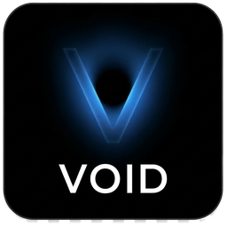

<div align="center">



# Void

**Reclaim your disk space.**

Void finds and cleans developer build artifacts across 11 ecosystems.
One scan, gigabytes back.

[](https://github.com/eladbash/void/actions/workflows/ci.yml)
[](https://github.com/eladbash/void/releases)
[](LICENSE)
[](https://www.rust-lang.org/)

[Download](https://github.com/eladbash/void/releases) · [Website](https://eladbash.github.io/void/) · [Contributing](CONTRIBUTING.md) · [Changelog](CHANGELOG.md)

</div>

---

## Why Void?

Every project you touch leaves something behind — a `target/` here, a `node_modules/` there,
a Docker build cache quietly eating 20 GB. You know it's there. You just don't know *where*,
or which parts are safe to remove.

Void answers both questions. It walks your home directory in parallel, groups everything it
finds by ecosystem, tells you how stale each artifact is, and labels every cleanup action with
a risk level before you click it. Nothing is deleted without your say-so.

## Highlights

- **11 ecosystem scanners** — Rust, Node.js, Python, Go, Java, Docker, Apple/Xcode, Homebrew, JetBrains, .NET, and system caches
- **Safety first** — blocked-path lists, sentinel-file detection, and Safe / Caution / Danger classification on every action
- **Fast** — multi-threaded filesystem walker with concurrent analysis, built on Tokio and the `ignore` crate
- **Staleness aware** — surfaces artifacts untouched for longer than your threshold (30 days by default), so you clean what you're not using
- **Lives in your menu bar** — quick-scan and open the dashboard without leaving your workflow
- **Yours to configure** — scan roots, enabled ecosystems, staleness thresholds, and paths Void must never touch

## Install

### macOS

```bash
curl -fsSL https://raw.githubusercontent.com/eladbash/void/main/install.sh | sh
```

Downloads the latest `.dmg` for your architecture, installs to `/Applications`, and launches it.

### Linux & Windows

Grab the installer for your platform from the [Releases page](https://github.com/eladbash/void/releases).

### From source

Requires [Rust](https://rustup.rs/) 1.95+ and the [Tauri CLI](https://tauri.app/).

```bash
git clone https://github.com/eladbash/void.git
cd void
cargo tauri dev      # run in development
cargo tauri build    # produce a release bundle
```

## How it works

1. **Scan** — Void walks your configured roots (your home directory by default) with a parallel
   walker, using half your cores and up to 8 concurrent analyses.
2. **Review** — results are grouped by ecosystem with size, last-modified date, and a risk level.
   Sort, filter, and pick exactly what you want gone.
3. **Clean** — each item carries its own action (`cargo clean`, `docker builder prune`, delete,
   move to Trash). Void runs it, verifies the safety gates first, and reports what it freed.

## What Void finds

| Ecosystem | Artifacts |
|-----------|-----------|
| **Rust** | `target/` dirs, cargo registry, git checkouts |
| **Node.js** | `node_modules/`, npm / yarn / pnpm caches |
| **Python** | `__pycache__/`, virtualenvs, pip and conda caches |
| **Go** | Build cache, module cache, test cache |
| **Java** | Gradle caches and build dirs, Maven `.m2/repository` |
| **Docker** | Dangling images, build cache, stopped containers, unused volumes |
| **Apple/Xcode** | DerivedData, archives, device support, simulator caches |
| **Homebrew** | Package download cache |
| **JetBrains** | Per-IDE caches (rebuilt on next launch) |
| **.NET** | NuGet cache, `bin/` and `obj/` dirs |
| **System** | Trash, application logs, stale downloads |

## Safety

Deleting files is easy to get wrong, so Void is deliberately conservative:

- **Never-touch paths** — `~/Documents`, `~/Desktop`, `~/Pictures`, `~/Library/Keychains`,
  `~/Library/Preferences`, plus anything named `.ssh`, `.gnupg`, `.aws`, `.config`, or `.env`
  anywhere in the path.
- **Sentinel detection** — a directory containing `.env`, `credentials`, `secrets.y(a)ml`,
  `id_rsa`, or `id_ed25519` is excluded from deletion outright.
- **Risk escalation** — paths directly under `$HOME` and symlinks are automatically promoted to
  a higher risk level.
- **Your own blocklist** — add any path in settings and Void will refuse to touch it.
- **Nothing is automatic** — Void never deletes anything you haven't explicitly selected.

Found a safety gap? Please report it privately — see [SECURITY.md](SECURITY.md).

## Project layout

```
crates/
  deepclean-core/   scanning engine, safety checker, action executor
  deepclean-app/    Tauri 2 desktop app, system tray, frontend
docs/               project website (GitHub Pages)
```

## Contributing

Contributions are genuinely welcome — a new ecosystem scanner is a great first PR.
Start with [CONTRIBUTING.md](CONTRIBUTING.md) and our [Code of Conduct](CODE_OF_CONDUCT.md).

## License

MIT — see [LICENSE](LICENSE).

---

<div align="center">

Built by [@eladbash](https://github.com/eladbash)

If Void bought you back some disk space, consider [sponsoring the project](https://github.com/sponsors/eladbash) ⭐

</div>
